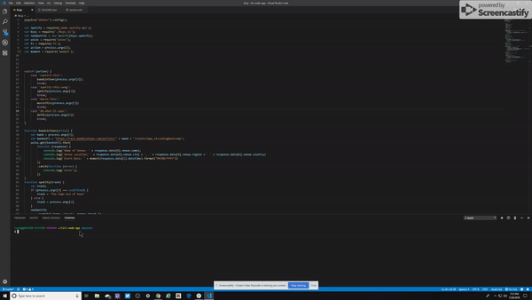
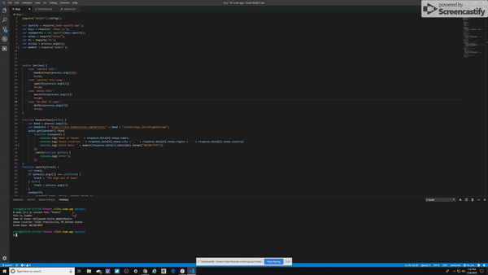
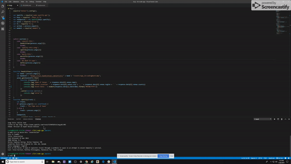

# liri-node-app

My name is Craig McAlister and I created this app through VS Code. I am the only contributor to this.

### Overview

This a LIRI command line node app, with this app you can type certain commands into your terminal and recieve information back.
This is an app for media lovers that can't find the information about their favorite things, wether it is Bands, Songs, or Movies you will 
get the information you need here.  It can tell you where your favorite band is performing next, it can also find you information about a 
song that you have been trying to find with a link to hear it, and it will get you information about your favorite movies. 

### How it works

1. First you have to open your bash or terminal.  You need to verify you have node.js installed in your terminal, by typing node into 
    command line and hitting enter. If you do ctrl+D to get back out, if not you need to install node.

2. Then clone my repo from github to your computer. (https://github.com/CMack704/liri-node-app.git)

3. Open the folder in vs code and then open your terminal(ctrl+`).

4. In the command line make sure you re-install the node-modules by typing npm install.

5. To run the app you always have to start your command with: 'node liri.js'. You have 4 choices with your next command.
    * 'concert-this'
    * 'spotify-this-song'
    * 'movie-this'
    * 'do-what-it-says'

6. Your next command depends on what you are looking for.
    * 'concert-this' type an artist that you would like to see in "" ex. "future" then it will tell you where you can see them next.
    * 'spotify-this-song' type a song name in "" ex. "thriller" it will give you artist name, album, and a link to hear it.
    * 'movie-this' type a movie name in "" ex. "interstellar" it will give; title, release date, imdb rating, rotten tomatoes rating, countries produced in, languages, plot, and cast.
    * 'do-what-it-says' just press enter after and it with spotify "I want it that way" and write text to random.txt file.

7. After you have typed your artist, song, or movie name hit enter and you will get your information.

### Gifs

1. concert-this
    
2. spotify-this-song 
    
3. movie-this
    
4. do-what-it-says
    

### Technologies

1. node.js this app runs through node in your terminal
2. Javasript it is written in javascript language
3. npm Modules like axios to get information from apis, spotify to get song information
4. apis to send the information to consoles. Bands in town api gives me the artist concert info and omdb gives me the movie info.
5. fs was used to read text from random.txt file and to write back to it.
6. moment was used to format date of concert
